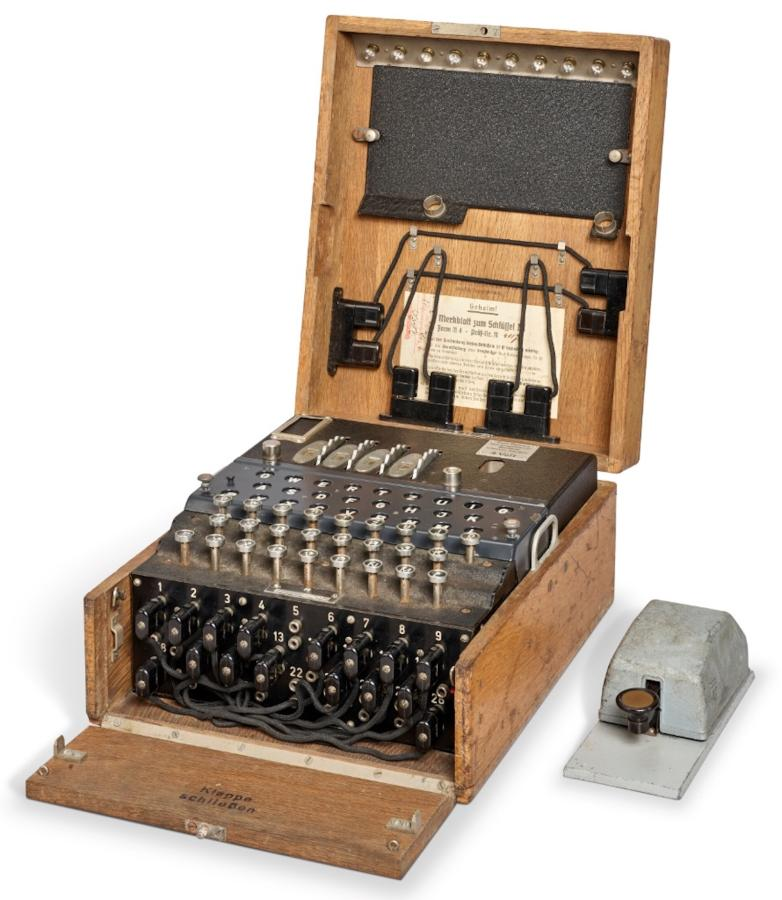
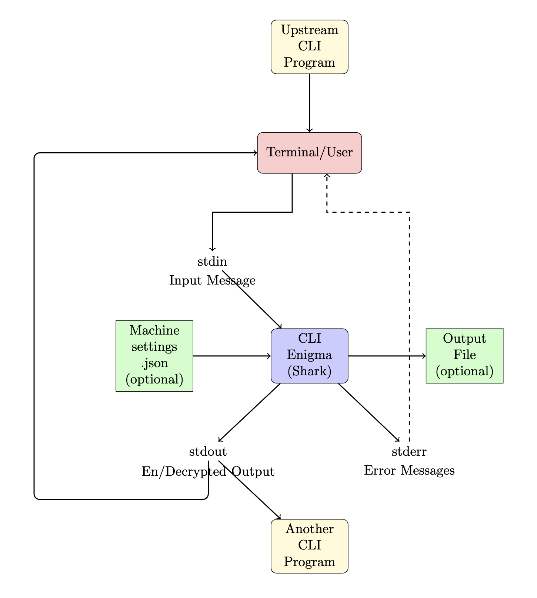

# shark
<p align="center">
  
</p>

A UNIX friendly CLI [Enigma](https://en.wikipedia.org/wiki/Enigma_machine) emulator.


`Shark` is named after the "Shark" Blackout of 1942, when the Kriegsmarine added a fourth rotor to their Enigma machines 
stymieing Bletchley Park's efforts to decipher Atlantic U-boat communications for nearly 10 months.

## Installation
[Cargo](https://crates.io/crates/enigma_shark):
```bash
$ cargo install enigma_shark
```
System wide:
```bash
$ curl -sSL https://raw.githubusercontent.com/mattlianje/shark/main/install.sh | bash

# Checks system wide install was successful 
$ enigma --help
```
Build source:
```bash
$ git clone https://github.com/mattlianje/shark.git
$ cd shark
$ cargo build --release
$ echo "HELLOWORLD" | ./target/release/enigma
# Will output
ZWMRGTTIIZ
```

## Use
```bash
# Chain enigma with other commands
$ echo "HELLO" | enigma | grep "FOO"

# Use your custom settings
$ cat config.json
{
    "rotors": [
        {"type_": "type_i", "position": "A", "ring_setting": "A"},
        {"type_": "type_ii", "position": "B", "ring_setting": "A"},
        {"type_": "type_iii", "position": "C", "ring_setting": "A"}
    ],
    "reflector": "ukw_b",
    "plugboard": [{"from": "A", "to": "B"}]
}

# Use these settings easily
$ enigma --input plaintext.txt --config config.json > encrypted.txt
```
## Features/Goals
- **UNIX Philosophy Adherence:** Shark focuses on doing one thing well: encryption.


- **Blazing Speed:** Primarily built to learn about Rust, I will continue to work on lowering the memory footprint of `shark` and making use of Rust's concurrency. Shark processes data in chunks, making it suitable for large datasets and > 50x faster on 5MB inputs than [other C++](benches/bench.sh) cli enigmas [^1].
- **Infinite Stream Capable:** Designed with streaming data in mind, Shark can handle infinite data streams, allowing for real-time encryption tasks.

[^1]: Encryption times for 5MB of data ... Shark: 53ms, C++ cli: 2693ms
