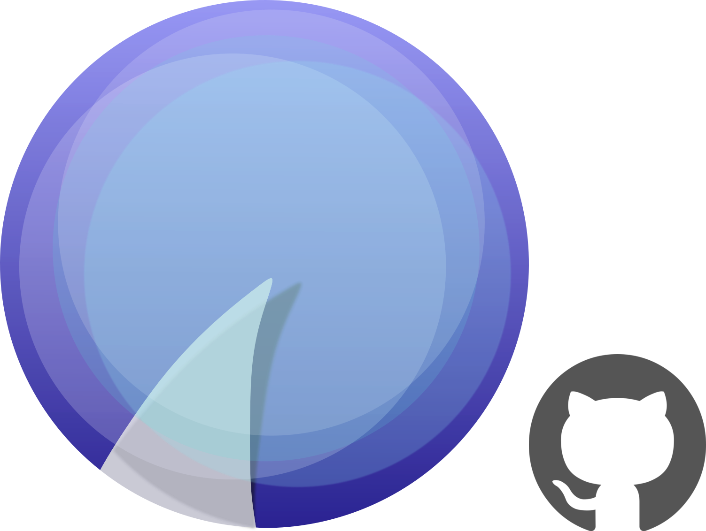
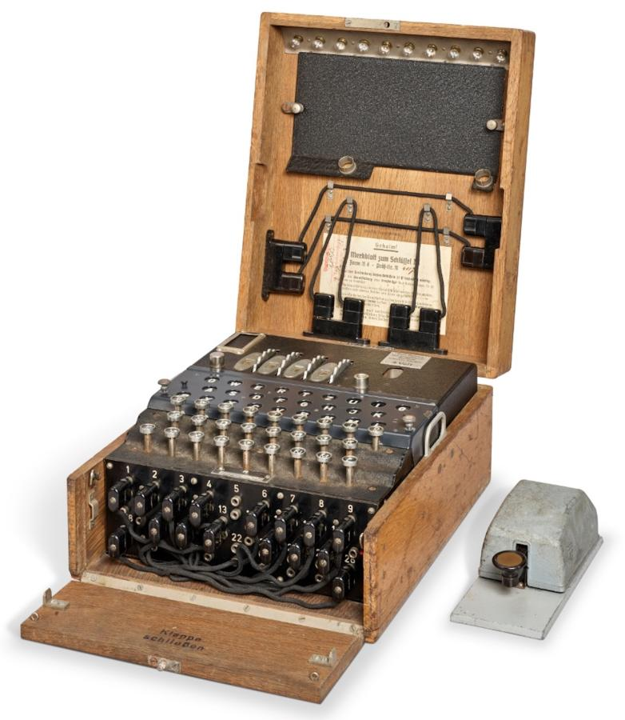

<p align="center">
  
</p>

# Shark
A UNIX friendly CLI [Enigma](https://en.wikipedia.org/wiki/Enigma_machine) emulator.

`Shark` is named after the "Shark" Blackout of 1942, when the Kriegsmarine added a fourth rotor to their Enigma machines 
stymieing Bletchley Park's efforts to decipher Atlantic U-boat communications for nearly 10 months.


<p align="center">
  
</p>

## Installation
Add this to your `Cargo.toml` for [crates.io/enigma_shark](https://crates.io/crates/enigma_shark):
```toml
[dependencies]
enigma_shark = "*"
```

System wide:
```bash
curl -sSL https://raw.githubusercontent.com/mattlianje/shark/main/install.sh | bash;
enigma --help
```

## Use
```bash
# Chain enigma with other commands
$ echo "HELLO" | enigma | grep "FOO"

# Use your custom settings
$ cat config.json
{
    "rotors": [
        {"type_": "i", "position": "A", "ring": "A"},
        {"type_": "ii", "position": "B", "ring": "A"},
        {"type_": "iii", "position": "C", "ring": "A"}
    ],
    "reflector": "ukw_b",
    "plugboard": {"A": "B"}
}

$ enigma --input plaintext.txt --config config.json > encrypted.txt
```
## Features/Goals
- **UNIX Philosophy Adherence:** Shark focuses on doing one thing well: symmetric en/decryption.
- **Speed:** Primarily built to learn about Rust, I will continue to work on lowering the memory footprint of `shark` and making use of Rust's concurrency. Shark is currently > 50x faster on 5MB inputs than performant [C++ cli enigmas](benches/bench.sh)[^1].
- **Infinite Stream Capable:** Shark chunks inputs by default and is built not to choke on infinite streams.

[^1]: Encryption times for 5MB of data ... Shark: 53ms, C++ cli: 2693ms
